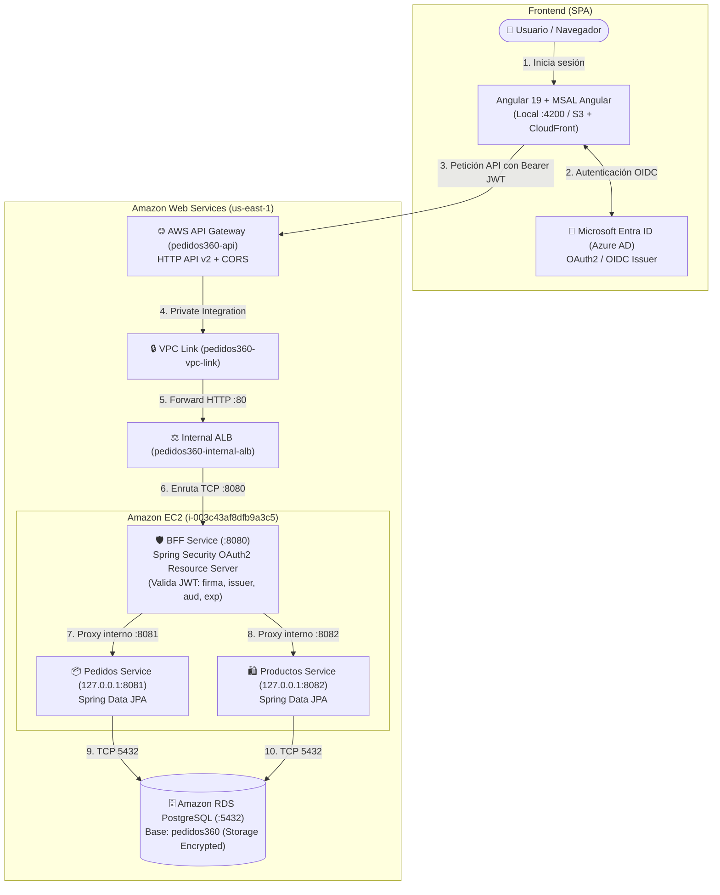

# Pedidos360 — Plataforma Cloud Native

Proyecto desarrollado para la asignatura **Desarrollo Cloud Native I (DSY1107)** - Duoc UC.

Plataforma integral de gestión de productos y pedidos implementada con arquitectura desacoplada de microservicios, seguridad OAuth2/OIDC con **Microsoft Entra ID (Azure AD)**, persistencia relacional con **Spring Data JPA / Amazon RDS PostgreSQL**, y fachada pública gestionada en **AWS API Gateway**.

---

## 1. Diagrama de Arquitectura Global



---

## 2. Microservicios y Componentes

| Componente | Tecnología | Puerto | Responsabilidad |
|---|---|---|---|
| **`frontend/pedidos360-web`** | Angular 19, MSAL Angular, Router, Standalone | `4200` | UI, autenticación con Entra ID, interceptor de token JWT |
| **`backend/bff-service`** | Java 21, Spring Boot 3.3.4, Spring Security, OAuth2 | `8080` | Resource Server JWT, agregador y único punto de entrada expuesto |
| **`backend/pedidos-service`** | Java 21, Spring Boot 3.3.4, Spring Data JPA | `8081` | Gestión de órdenes de compra, estados y persistencia en RDS |
| **`backend/productos-service`** | Java 21, Spring Boot 3.3.4, Spring Data JPA | `8082` | Catálogo de productos, control de stock y persistencia en RDS |
| **Amazon RDS** | PostgreSQL 16.3 | `5432` | Base de datos relacional privada y cifrada |
| **AWS API Gateway** | HTTP API v2 | `443` | Fachada pública con soporte CORS y proxy hacia el backend |

---

## 3. Catálogo de Endpoints REST

### 3.1 Productos (`/api/productos`)
| Método | Endpoint | Respuesta Exitosa | Descripción |
|---|---|---|---|
| `GET` | `/api/productos` | `200 OK` | Lista todos los productos activos |
| `GET` | `/api/productos/{id}` | `200 OK` / `404 Not Found` | Obtiene un producto por su ID |
| `POST` | `/api/productos` | `201 Created` / `400 Bad Request` | Crea un nuevo producto (requiere autenticación) |
| `PUT` | `/api/productos/{id}` | `200 OK` / `404 Not Found` | Actualiza un producto existente |
| `DELETE` | `/api/productos/{id}` | `204 No Content` / `404 Not Found` | Desactivación lógica del producto |

### 3.2 Pedidos (`/api/pedidos`)
| Método | Endpoint | Respuesta Exitosa | Descripción |
|---|---|---|---|
| `GET` | `/api/pedidos` | `200 OK` | Lista pedidos (filtro opcional `?usuario=`) |
| `GET` | `/api/pedidos/{id}` | `200 OK` / `404 Not Found` | Obtiene un pedido por su ID |
| `GET` | `/api/pedidos/usuario/{usuario}` | `200 OK` | Obtiene los pedidos asociados a un usuario |
| `POST` | `/api/pedidos` | `201 Created` / `400 Bad Request` | Crea un nuevo pedido |
| `PUT` | `/api/pedidos/{id}` | `200 OK` / `404 Not Found` | Actualiza monto o estado del pedido |
| `DELETE` | `/api/pedidos/{id}` | `204 No Content` / `404 Not Found` | Elimina el registro de pedido |

### 3.3 Health Checks
- `GET /api/health` -> `{ "service": "<nombre>", "status": "UP" }` (HTTP 200)
- `GET /actuator/health` -> `{ "status": "UP" }` (HTTP 200)

---

## 4. Estructura del Repositorio

```text
Pedidos360/
├── frontend/
│   └── pedidos360-web/        # Aplicación Angular 19 con MSAL
│       ├── src/app/pages/     # Vistas: home, login, productos, pedidos, perfil
│       ├── src/app/auth/      # Configuración de MSAL, Guard e Interceptor
│       └── src/environments/ # Variables de entorno y configuración Entra ID
├── backend/
│   ├── bff-service/           # BFF Spring Boot + OAuth2 Resource Server
│   ├── pedidos-service/       # Microservicio Pedidos + Spring Data JPA
│   └── productos-service/     # Microservicio Productos + Spring Data JPA
├── infra/aws/
│   ├── api-gateway/           # Documentación y plan de integración HTTP API v2
│   ├── ec2/                   # Unidades systemd, user-data y entorno
│   ├── iam/                   # Políticas de referencia y roles
│   ├── network/               # Security Groups y topología de red
│   └── rds/                   # Documentación y plan de Amazon RDS PostgreSQL
├── scripts/                   # Scripts de build y verificación (PowerShell/Bash)
├── docs/                      # Documentación de arquitectura, BD, API y auth
│   ├── architecture.md
│   ├── database.md
│   ├── api-gateway.md
│   ├── authentication.md
│   ├── testing.md
│   ├── backend-deployment-aws.md
│   └── INFORME_PEDIDOS360.pdf # Informe técnico completo en PDF
└── .env.example               # Plantilla de variables de entorno sanitizada
```

---

## 5. Instrucciones de Ejecución

### 5.1 Ejecución Local

#### Backend (Java 21 / Spring Boot):
```bash
# Compilar y ejecutar BFF (:8080)
cd backend/bff-service && ./mvnw spring-boot:run

# Compilar y ejecutar Pedidos (:8081)
cd backend/pedidos-service && ./mvnw spring-boot:run

# Compilar y ejecutar Productos (:8082)
cd backend/productos-service && ./mvnw spring-boot:run
```

#### Frontend (Angular):
```bash
cd frontend/pedidos360-web
npm install
npm start # Disponible en http://localhost:4200
```

#### Compilación completa automatizada:
```powershell
powershell -ExecutionPolicy Bypass -File scripts/build-all.ps1
```

---

## 6. Pruebas Automatizadas y Calidad

- **Backend**: **76 pruebas automatizadas** ejecutadas con 100% de éxito (0 fallos).
  - `bff-service`: 18 tests (orquestación, seguridad JWT, health checks).
  - `pedidos-service`: 30 tests (CRUD, enum de estados, validaciones, JPA).
  - `productos-service`: 28 tests (CRUD, borrado lógico, validaciones, JPA).
- **Aislamiento**: Pruebas ejecutadas con base de datos H2 en memoria (`scope=test`), sin dependencia de servicios cloud activos.
- **Frontend**: Build de producción verificado con `ng build` (0 errores).

---

## 7. Seguridad y Cero Secretos

- **Sin secretos en Git**: Repositorio escaneado y libre de Access Keys, Secret Keys, contraseñas, tokens JWT o archivos `.key` / `.pem`.
- **Variables de Entorno**: Inyección de credenciales en runtime mediante `/etc/pedidos360/*.env` con permisos `640` y propietario `root:pedidos360`.
- **Aislamiento de Red**: Microservicios `pedidos-service` y `productos-service` escuchan exclusivamente en `127.0.0.1` sin acceso público desde Internet.
