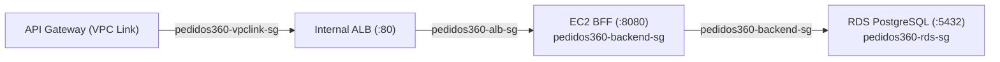

# 📦 Pedidos360 — Plataforma Cloud Native

> **Evaluación Parcial 1 — Desarrollo Cloud Native I (DSY1107)**  
> **Institución:** Duoc UC — Escuela de Informática y Telecomunicaciones  
> **Infraestructura Cloud:** Amazon Web Services (AWS) — Región `us-east-1`  
> **Proveedor de Identidad (IdaaS):** Microsoft Entra ID (Azure AD)  

---

## 📑 Tabla de Contenidos
1. [Descripción General](#1-descripción-general)
2. [Arquitectura Global del Sistema](#2-arquitectura-global-del-sistema)
3. [Microservicios Backend](#3-microservicios-backend)
4. [Persistencia Relacional (Spring Data JPA & PostgreSQL)](#4-persistencia-relacional-spring-data-jpa--postgresql)
5. [Seguridad, Autenticación y Autorización (Microsoft Entra ID & JWT)](#5-seguridad-autenticación-y-autorización-microsoft-entra-id--jwt)
6. [Infraestructura y Redes en AWS](#6-infraestructura-y-redes-en-aws)
7. [AWS API Gateway & Política CORS](#7-aws-api-gateway--política-cors)
8. [Frontend Angular (SPA)](#8-frontend-angular-spa)
9. [Catálogo de Endpoints de la API](#9-catálogo-de-endpoints-de-la-api)
10. [Instrucciones de Ejecución y Compilación](#10-instrucciones-de-ejecución-y-compilación)
11. [Pruebas Automatizadas y Calidad de Código](#11-pruebas-automatizadas-y-calidad-de-código)
12. [Estructura del Proyecto y Documentación](#12-estructura-del-proyecto-y-documentación)
13. [Políticas de Seguridad y Cero Secretos](#13-políticas-de-seguridad-y-cero-secretos)

---

## 1. Descripción General

**Pedidos360** es una plataforma moderna para la gestión de productos y procesamiento de pedidos de clientes construida siguiendo los principios de la arquitectura **Cloud Native**:
- **Desacoplamiento de Servicios:** Separación estricta entre capa de presentación (Angular), agregador/puerta de enlace interna (BFF) y microservicios de dominio (`pedidos-service` y `productos-service`).
- **Aislamiento de Red:** Los microservicios de dominio y la base de datos se ejecutan de manera privada sin exposición directa a Internet.
- **Autenticación Federada:** Inicio de sesión empresarial con **Microsoft Entra ID** (OAuth2/OIDC) y validación de tokens criptográficos **JWT** en el backend.
- **Persistencia Gestionada:** Base de datos relacional con **Amazon RDS PostgreSQL** cifrada en reposo.
- **Fachada Pública Gestionada:** Exposición de endpoints centralizada a través de **AWS API Gateway (HTTP API v2)** con enrutamiento proxy y control de CORS.

---

## 2. Arquitectura Global del Sistema

### 2.1 Diagrama de Arquitectura de Alto Nivel

```mermaid
flowchart TD
    subgraph Client ["Capa Cliente / Frontend"]
        User(["👤 Usuario / Navegador"])
        Angular["🌐 Angular 19 (SPA)<br/>MSAL Angular + Router<br/>(Local :4200 / S3 + CloudFront)"]
        EntraID["🔐 Microsoft Entra ID (Azure AD)<br/>OAuth2 / OpenID Connect Issuer"]
    end

    subgraph AWSCloud ["Amazon Web Services (us-east-1)"]
        APIGW["🚪 AWS API Gateway (pedidos360-api)<br/>HTTP API v2 + CORS + Proxy ANY /api/{proxy+}"]
        VPCLink["🔒 VPC Link (pedidos360-vpc-link)"]
        ALB["⚖️ Internal ALB (pedidos360-internal-alb)<br/>Listener HTTP :80"]

        subgraph EC2Host ["Amazon EC2 Instance (i-003c43af8dfb9a3c5)"]
            BFF["🛡️ BFF Service (:8080)<br/>Spring Security OAuth2 Resource Server<br/>(Valida JWT: firma, issuer, aud, exp, roles)"]
            
            subgraph InternalServices ["Servicios Internos (Loopback 127.0.0.1)"]
                Pedidos["📦 Pedidos Service (127.0.0.1:8081)<br/>Spring Data JPA + PostgreSQL"]
                Productos["🛍️ Productos Service (127.0.0.1:8082)<br/>Spring Data JPA + PostgreSQL"]
            end
        end

        RDS[("🗄️ Amazon RDS PostgreSQL (:5432)<br/>Base: pedidos360 (Storage Encrypted KMS)<br/>Security Group: pedidos360-rds-sg")]
    end

    User -->|1. Inicia sesión| Angular
    Angular <-->|2. Autenticación OIDC / Tokens| EntraID
    Angular -->|3. Petición HTTP con Bearer JWT| APIGW
    APIGW -->|4. Private Integration| VPCLink
    VPCLink -->|5. Tráfico HTTP :80| ALB
    ALB -->|6. Forward TCP :8080| BFF
    BFF -->|7. Proxy interno :8081| Pedidos
    BFF -->|8. Proxy interno :8082| Productos
    Pedidos -->|9. TCP 5432 (JPA)| RDS
    Productos -->|10. TCP 5432 (JPA)| RDS
```

### 2.2 Tabla de Componentes y Puertos

| Componente | Tecnología | Puerto | Visibilidad | Responsabilidad Principal |
|---|---|---|---|---|
| **Frontend Web** | Angular 19 + MSAL | `4200` (dev) / `443` (prod) | Pública | Interfaz de usuario reactiva, login Entra ID, interceptor JWT |
| **API Gateway** | AWS API Gateway v2 | `443` (HTTPS) | Pública | Fachada pública gestionada, gestión de CORS y enrutamiento proxy |
| **Internal ALB** | AWS Application Load Balancer | `80` (HTTP) | Privada VPC | Balanceo y reenvío de tráfico interno hacia el BFF |
| **BFF Service** | Spring Boot 3.3.4 | `8080` (`0.0.0.0`) | Privada VPC | Resource Server JWT, agregación y comunicación con microservicios |
| **Pedidos Service** | Spring Boot 3.3.4 + JPA | `8081` (`127.0.0.1`) | Loopback EC2 | Gestión de órdenes de compra y ciclo de vida de pedidos |
| **Productos Service** | Spring Boot 3.3.4 + JPA | `8082` (`127.0.0.1`) | Loopback EC2 | Catálogo de productos, control de stock y borrado lógico |
| **Base de Datos** | Amazon RDS PostgreSQL 16.3 | `5432` | Privada VPC | Persistencia relacional de productos y pedidos |

---

## 3. Microservicios Backend

Cada microservicio está construido con **Java 21**, **Spring Boot 3.3.4** y empaquetado como un `.jar` ejecutable independiente.

### 3.1 BFF Service (`bff-service`)
- **Puerto:** `8080` (escucha en `0.0.0.0:8080`).
- **Seguridad:** Configurado como **OAuth2 Resource Server** con Spring Security para validar tokens JWT contra el JWKS oficial de Microsoft Entra ID.
- **Orquestación:** Utiliza `RestClient` con timeouts controlados (conexión: 3s, lectura: 5s) hacia `pedidos-service` y `productos-service`.
- **Tolerancia a Fallos:** Manejador global `GlobalBffExceptionHandler` que transforma caídas de servicios downstream en respuestas HTTP `503 Service Unavailable` estructuradas en JSON.
- **Aislamiento de BD:** No interactúa directamente con la base de datos (cero dependencias de base de datos en el BFF).

### 3.2 Productos Service (`productos-service`)
- **Puerto:** `8082` (escucha en `127.0.0.1:8082`, no expuesto públicamente).
- **Entidad `Producto`:**
  - `id`: `Long` (Auto-incremental PK).
  - `nombre`: `String` (`@NotBlank`, máx 100 caracteres).
  - `descripcion`: `String` (máx 500 caracteres).
  - `precio`: `BigDecimal` (`@DecimalMin("0.0")`, `@NotNull`).
  - `stock`: `Integer` (`@Min(0)`, `@NotNull`).
  - `activo`: `Boolean` (por defecto `true`, soporte para borrado lógico).
  - `createdAt` / `updatedAt`: `LocalDateTime` (auditoría automática con `@PrePersist` y `@PreUpdate`).
- **Capa Service:** Implementa operaciones transaccionales `@Transactional` y lógica de desactivación `activo = false` en `delete()`.

### 3.3 Pedidos Service (`pedidos-service`)
- **Puerto:** `8081` (escucha en `127.0.0.1:8081`, no expuesto públicamente).
- **Entidad `Pedido`:**
  - `id`: `Long` (Auto-incremental PK).
  - `usuario`: `String` (`@NotBlank`, email/ID del cliente).
  - `fecha`: `LocalDateTime` (asignada en la creación).
  - `estado`: Enum `EstadoPedido` (`PENDIENTE`, `CONFIRMADO`, `EN_PROCESO`, `COMPLETADO`, `CANCELADO`) persistido como `@Enumerated(EnumType.STRING)`.
  - `total`: `BigDecimal` (`@DecimalMin("0.0")`, `@NotNull`).
  - `createdAt` / `updatedAt`: `LocalDateTime` (auditoría temporal automática).
- **Consultas del Repositorio:** `findByUsuario(usuario)` y `findByEstado(estado)`.

---

## 4. Persistencia Relacional (Spring Data JPA & PostgreSQL)

### 4.1 Datasource Parametrizado por Variables de Entorno
En `application-aws.properties`:
```properties
spring.datasource.url=jdbc:postgresql://${DB_HOST:localhost}:${DB_PORT:5432}/${DB_NAME:pedidos360}
spring.datasource.username=${DB_USERNAME:dbadmin}
spring.datasource.password=${DB_PASSWORD:}
spring.datasource.driver-class-name=org.postgresql.Driver

spring.jpa.hibernate.ddl-auto=update
spring.jpa.show-sql=false
spring.jpa.open-in-view=false
spring.jpa.properties.hibernate.dialect=org.hibernate.dialect.PostgreSQLDialect
```

### 4.2 Estrategia de Pruebas Aisladas (H2 in-memory)
Para permitir que las pruebas unitarias y de integración se ejecuten de forma autónoma sin depender de AWS RDS, se configuró una base de datos **H2 en memoria** con compatibilidad PostgreSQL en `src/test/resources/application.properties`:
```properties
spring.datasource.url=jdbc:h2:mem:pedidosdb;DB_CLOSE_DELAY=-1;DB_CLOSE_ON_EXIT=FALSE;MODE=PostgreSQL
spring.datasource.driver-class-name=org.h2.Driver
spring.datasource.username=sa
spring.datasource.password=
spring.jpa.database-platform=org.hibernate.dialect.H2Dialect
spring.jpa.hibernate.ddl-auto=create-drop
```

---

## 5. Seguridad, Autenticación y Autorización (Microsoft Entra ID & JWT)

### 5.1 Flujo de Identidad con Entra ID (Azure AD)
```text
1. El usuario hace clic en "Iniciar Sesión" en el Frontend Angular.
2. MSAL redirige al flujo de autenticación de Microsoft (OAuth2 / OIDC).
3. Microsoft Entra ID valida las credenciales institucionales y emite:
   - ID Token (perfil y claims del usuario).
   - Access Token JWT (destinado a la API de Pedidos360).
4. MsalInterceptor adjunta automáticamente el Access Token en cada petición HTTP:
   Authorization: Bearer <Token_JWT>
5. AWS API Gateway recibe la petición y la reenvía de forma segura al BFF.
6. Spring Security en el BFF valida el token:
   - Firma criptográfica contra las claves públicas (JWKS).
   - Issuer: https://login.microsoftonline.com/{tenant-id}/v2.0
   - Audience: api://{client-id}
   - Expiración (exp) y claims de roles.
7. Si el token es válido, se ejecuta la operación; en caso contrario se retorna 401/403.
```

### 5.2 Matriz de Códigos de Respuesta HTTP

| Estado | Código HTTP | Condición |
|---|---|---|
| **Éxito / Lectura** | `200 OK` | Petición procesada correctamente o consulta pública |
| **Creación** | `201 Created` | Registro creado exitosamente |
| **Eliminación** | `204 No Content` | Recurso eliminado / desactivado lógicamente |
| **Error de Validación** | `400 Bad Request` | Cuerpo inválido (ej. precio negativo, nombre vacío) |
| **No Autenticado** | `401 Unauthorized` | Token ausente, firma inválida o token expirado |
| **No Autorizado** | `403 Forbidden` | Usuario autenticado sin el rol o scope requerido |
| **No Encontrado** | `404 Not Found` | ID de producto o pedido inexistente |
| **Fallo Downstream** | `503 Service Unavailable` | Microservicio interno temporalmente no disponible |

---

## 6. Infraestructura y Redes en AWS

### 6.1 Instancia Amazon EC2 (`pedidos360-backend`)
- **ID:** `i-003c43af8dfb9a3c5`
- **Región:** `us-east-1`
- **Tipo de Instancia:** `t3.medium` (2 vCPU, 4 GiB RAM)
- **Sistema Operativo:** Amazon Linux 2023
- **Runtime:** Java Amazon Corretto 21
- **Administración:** AWS Systems Manager (SSM Run Command / Session Manager)
- **Gestor de Procesos:** `systemd` con unidades de reinicio automático (`Restart=always`, `RestartSec=5`) ejecutadas bajo el usuario del sistema `pedidos360`.

### 6.2 Matriz de Security Groups (Principio de Mínimo Privilegio)



| Security Group | Puerto | Protocolo | Origen Autorizado | Propósito |
|---|---|---|---|---|
| `pedidos360-backend-sg` | `22` | TCP | `IP_ADMIN/32` | Acceso SSH temporal restringido (preferir SSM) |
| `pedidos360-backend-sg` | `8080` | TCP | `pedidos360-alb-sg` | Tráfico entrante exclusivo desde el balanceador |
| `pedidos360-rds-sg` | `5432` | TCP | `pedidos360-backend-sg` | Tráfico exclusivo microservicios &rarr; RDS PostgreSQL |
| `pedidos360-alb-sg` | `80` | TCP | `pedidos360-vpclink-sg` | Tráfico interno desde la interfaz VPC Link |
| `pedidos360-vpclink-sg` | Egress | TCP | `172.31.0.0/16` | Comunicación interna hacia las subredes del balanceador |

---

## 7. AWS API Gateway & Política CORS

- **Nombre de la API:** `pedidos360-api` (HTTP API v2).
- **Rutas Configuradas:**
  - `GET /api/health` &rarr; Health check del BFF.
  - `ANY /api/{proxy+}` &rarr; Enrutamiento transparente a `/api/{proxy}` en el BFF.
- **Configuración CORS:**
  - **Orígenes Permitidos:** `http://localhost:4200` (desarrollo) y dominio CloudFront (producción).
  - **Métodos:** `GET`, `POST`, `PUT`, `DELETE`, `OPTIONS`.
  - **Cabeceras:** `authorization`, `content-type`, `x-requested-with`.
  - **Preflight:** Gestionado automáticamente por API Gateway con respuesta `204 No Content`.

---

## 8. Frontend Angular (SPA)

Desarrollado con **Angular 19** utilizando componentes **standalone** y soporte modular:
- **Vistas implementadas:**
  - `/home`: Panel de bienvenida y estado general de la plataforma.
  - `/login`: Formulario de autenticación federada con botón interactivo de Microsoft Entra ID.
  - `/productos`: Catálogo en cuadrícula con filtros de stock, creación y edición modal.
  - `/pedidos`: Tabla de órdenes de compra con selector dinámico de estados (`PENDIENTE`, `CONFIRMADO`, `EN_PROCESO`, `COMPLETADO`, `CANCELADO`). Protegido por `MsalGuard`.
  - `/perfil`: Vista de usuario autenticado, mostrando Tenant ID, claims del token de identidad y roles asignados. Protegido por `MsalGuard`.
- **MSAL Interceptor:** Inyección automática del Bearer Token en todas las llamadas a la API REST.

---

## 9. Catálogo de Endpoints de la API

### Productos (`/api/productos`)
```http
GET    /api/productos               -> Lista productos activos (query opcional: ?soloActivos=true/false)
GET    /api/productos/{id}          -> Obtiene detalle de un producto por ID
POST   /api/productos               -> Crea un nuevo producto (requiere JWT)
PUT    /api/productos/{id}          -> Actualiza datos de un producto (requiere JWT)
DELETE /api/productos/{id}          -> Desactiva lógicamente un producto (activo=false)
```

### Pedidos (`/api/pedidos`)
```http
GET    /api/pedidos                 -> Lista pedidos (query opcional: ?usuario={email})
GET    /api/pedidos/{id}            -> Obtiene detalle de un pedido por ID
GET    /api/pedidos/usuario/{user}  -> Lista los pedidos de un usuario específico
POST   /api/pedidos                 -> Registra un nuevo pedido
PUT    /api/pedidos/{id}            -> Actualiza estado/monto de un pedido
DELETE /api/pedidos/{id}            -> Elimina el registro del pedido
```

### Health & Monitoreo
```http
GET    /api/health                  -> {"service": "bff-service", "status": "UP"}
GET    /actuator/health             -> {"status": "UP"}
```

---

## 10. Instrucciones de Ejecución y Compilación

### 10.1 Requisitos Previos
- **Java JDK:** Amazon Corretto o OpenJDK 21+.
- **Node.js:** v20+ / v22+ y npm v10+.
- **PowerShell** (Windows) o **Bash** (Linux/macOS).

### 10.2 Ejecución Local del Backend
```bash
# Terminal 1: BFF Service (:8080)
cd backend/bff-service
./mvnw spring-boot:run

# Terminal 2: Pedidos Service (:8081)
cd backend/pedidos-service
./mvnw spring-boot:run

# Terminal 3: Productos Service (:8082)
cd backend/productos-service
./mvnw spring-boot:run
```

### 10.3 Ejecución del Frontend
```bash
cd frontend/pedidos360-web
npm install
npm start
# Aplicación disponible en http://localhost:4200
```

### 10.4 Compilación Completa Automatizada
```powershell
# En Windows PowerShell
powershell -ExecutionPolicy Bypass -File scripts/build-all.ps1
```

---

## 11. Pruebas Automatizadas y Calidad de Código

El proyecto cuenta con **76 pruebas automatizadas** en el backend ejecutadas con **100% de éxito (0 fallos)**:

| Módulo | Tests | Estado | Cobertura Principal |
|---|---|---|---|
| `bff-service` | **18** | ✅ PASS | Orquestación REST, Spring Security JWT, 401 Unauthorized, health endpoints |
| `pedidos-service` | **30** | ✅ PASS | CRUD Pedido, enum de estados, validaciones Jakarta, repositorio JPA |
| `productos-service` | **28** | ✅ PASS | CRUD Producto, borrado lógico, validaciones Jakarta, repositorio JPA |
| **Frontend Web** | Build OK | ✅ PASS | Compilación de producción (`ng build`) sin errores |

### 11.1 Hashes de Integridad SHA256 de los Artefactos
```text
bff-service.jar:
  SHA256: D013962EB55F79F74B75DE6EAF366EE22B87434561E3B219D0DBEF1B04BBC803

pedidos-service.jar:
  SHA256: 4CD2048834548B41FDD150B1DECA66B3CC68B99710694879CC6100A39B88B4D6

productos-service.jar:
  SHA256: B24890C30762326273C793D3F0E60B657A9E498171222C2A850429C0E5D64A4A
```

---

## 12. Estructura del Proyecto y Documentación

```text
Pedidos360/
├── frontend/
│   └── pedidos360-web/        # Aplicación Angular 19 SPA con MSAL
├── backend/
│   ├── bff-service/           # Orquestador BFF + Spring Security JWT (:8080)
│   ├── pedidos-service/       # Microservicio Pedidos + JPA (:8081)
│   └── productos-service/     # Microservicio Productos + JPA (:8082)
├── infra/aws/
│   ├── api-gateway/           # Documentación y plan HTTP API v2
│   ├── ec2/                   # Unidades systemd y variables de entorno
│   ├── iam/                   # Políticas IAM y documentación de roles
│   ├── network/               # Security Groups y arquitectura de red
│   └── rds/                   # Documentación y plan de Amazon RDS PostgreSQL
├── scripts/                   # Scripts PowerShell y Bash de build y deploy
├── docs/                      # Manuales técnicos detallados
│   ├── architecture.md        # Arquitectura y flujos de datos
│   ├── database.md            # Modelo de persistencia y entidades
│   ├── api-gateway.md         # Fachada pública y CORS
│   ├── authentication.md      # Microsoft Entra ID y seguridad JWT
│   ├── testing.md             # Guía de pruebas automatizadas
│   ├── backend-deployment-aws.md # Evidencia de despliegue EC2
│   └── INFORME_PEDIDOS360.pdf # Informe técnico completo en PDF
├── dist/                      # Artefactos .jar y compilados (no versionado)
└── .env.example               # Plantilla de variables de entorno sanitizada
```

---

## 13. Políticas de Seguridad y Cero Secretos

- **Cero Secretos en el Repositorio:** El repositorio se mantiene estrictamente libre de credenciales, Access Keys, Secret Keys, contraseñas, tokens JWT, certificados `.pem` o archivos `.key`.
- **Inyección en Runtime:** Las credenciales de base de datos e identidad se inyectan en tiempo de ejecución a través de variables de entorno (`/etc/pedidos360/*.env`) con permisos `640` y propietario `root:pedidos360`.
- **Aislamiento por Loopback:** `pedidos-service` y `productos-service` escuchan exclusivamente en `127.0.0.1`, impidiendo cualquier conexión directa desde fuera de la instancia EC2.
- **Filtro de Red Stateful:** La base de datos RDS rechaza conexiones de cualquier origen que no sea el Security Group de la instancia backend (`pedidos360-backend-sg`).
